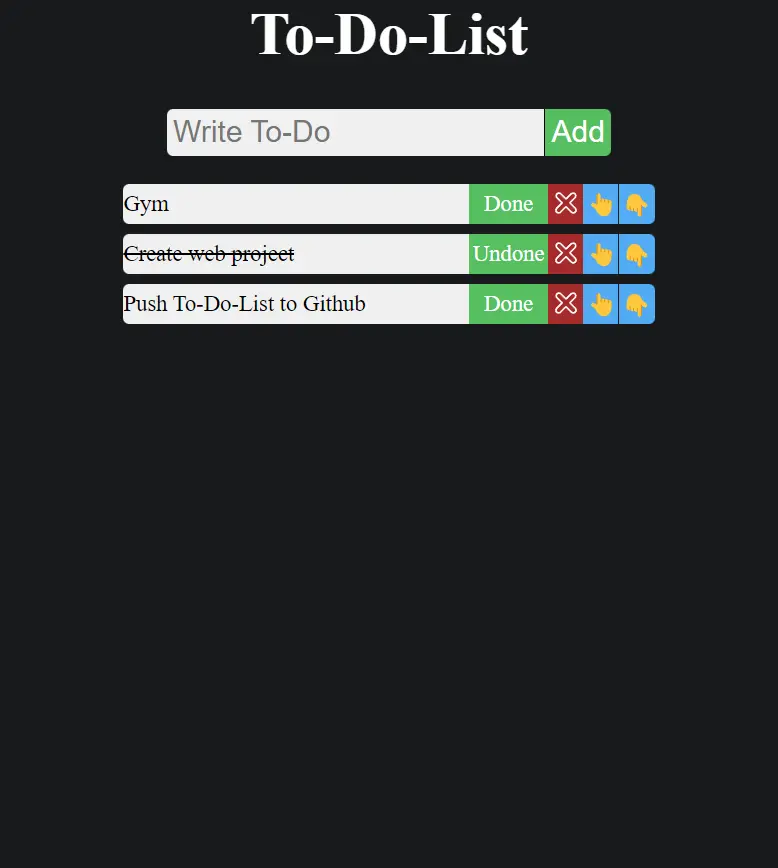

# To-Do-List React App

This is a simple To-Do List application built using React. It allows users to add, delete, mark as done/undone, and rearrange tasks.

## Features

- Add new tasks to the list.
- Mark tasks as done or undone.
- Delete tasks.
- Rearrange tasks by moving them up or down in the list.

## Technologies Used

- **React:** The frontend library used for building the user interface.
- **CSS Modules:** Used for styling components.
- **Vite:** The build tool used for development and production builds.
- **ESLint:** Used for linting JavaScript and JSX code.

## Usage

To run the project locally, follow these steps:

1. Clone the repository:

    ```bash
    git clone https://github.com/alirezabandegi/To-Do-List-React.git
    ```

2. Install dependencies:

    ```bash
    cd To-Do-List-React
    npm install
    ```

3. Start the development server:

    ```bash
    npm run dev
    ```

## Screenshots



## Contributing

Contributions are welcome! If you have any ideas, suggestions, or found any issues, feel free to open an issue or create a pull request.
